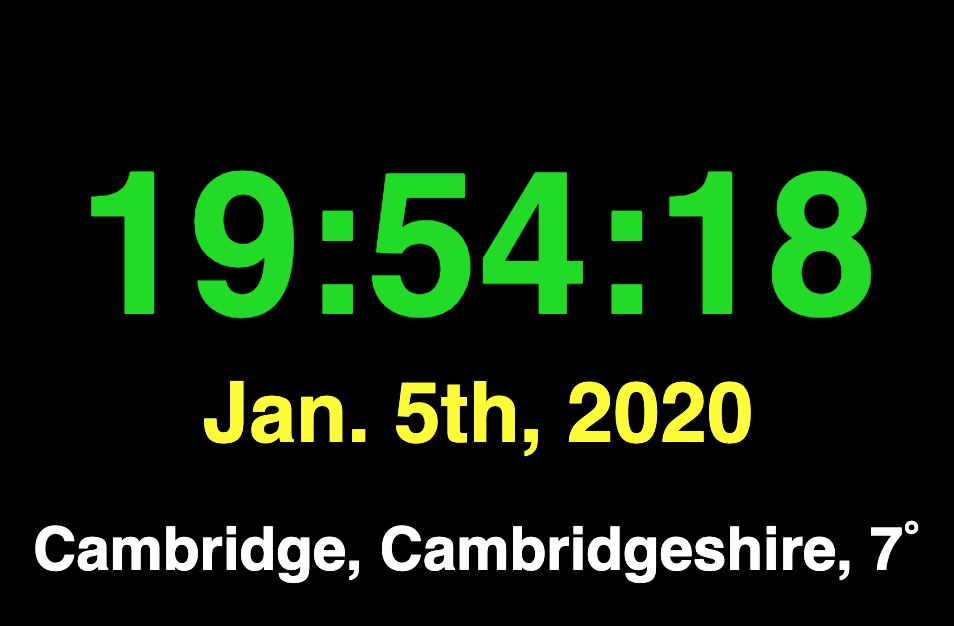

# Raspberry P5.js Weather Clock

[](https://github.com/sindresorhus/awesome)

<a href="https://www.raspberrypi.org"></a>

> The Raspberry Pi is a series of credit card-sized single-board computers developed in the United Kingdom by the Raspberry Pi Foundation to promote the teaching of basic computer science in schools and developing countries. Official Link: [Raspberry Pi Homepage](https://raspberrypi.org)

The project is to show you how to create a weather application in raspberry pi with 3.5 inch screen.

Contributions *very welcome* but first see [Contributing](#contributing)

## Requirement

- [Raspberry Pi](#Raspberry-Pi)
- [Rasbian OS Images](#os-images)
- [Chromium](#Chromium)
- [3.5Inch Monitor](#3.5-inch)

## Available Models

The complete collection of (consumer) Raspberry Pi models consist of:

- Raspberry Pi 1, Model A & Model B (2012, discontinued)
- [Raspberry Pi 1, Model B+](https://www.raspberrypi.org/products/raspberry-pi-1-model-b-plus/) (July, 2014)
- [Raspberry Pi 1, Model A+](https://www.raspberrypi.org/products/raspberry-pi-1-model-a-plus/) (November, 2014)
- [Raspberry Pi 2, Model B](https://www.raspberrypi.org/products/raspberry-pi-2-model-b/) (February, 2015)
- [Raspberry Pi Zero](https://www.raspberrypi.org/products/raspberry-pi-zero/) (November, 2015)
- [Raspberry Pi 3, Model B](https://www.raspberrypi.org/products/raspberry-pi-3-model-b/) (March, 2016)
- [Raspberry Pi Zero W](https://www.raspberrypi.org/products/raspberry-pi-zero-w/) (February, 2017)
- [Raspberry Pi 3, Model B+](https://www.raspberrypi.org/products/raspberry-pi-3-model-b-plus/) (March, 2018)
- [Raspberry Pi 3, Model A+](https://www.raspberrypi.org/products/raspberry-pi-3-model-a-plus/) (November, 2018)
- [Raspberry Pi 4, Model B](https://www.raspberrypi.org/products/raspberry-pi-4-model-b/) (June, 2019)

### Tutorials



***Install***
```
git clone https://github.com/shijiezhou1/raspberry-p5-weather-clock.git
```

### Contributing

Contribution guidelines can be found [here](/CONTRIBUTING.md)

### License

[](https://creativecommons.org/publicdomain/zero/1.0/)
